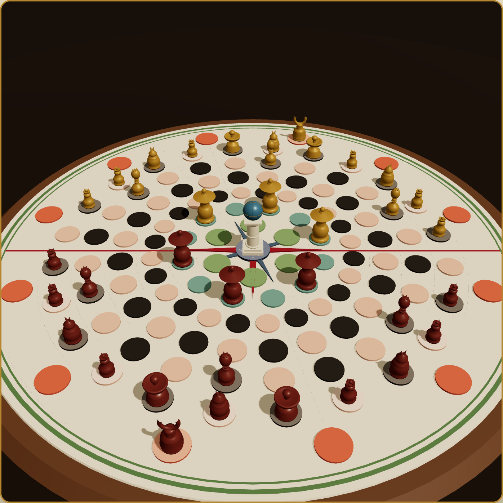

# El Olimpo

Recreación digital de **«El Olimpo»**, un juego de mesa místico-filosófico-recreativo descripto en un libro español de **1891** que, hasta donde sabemos, nunca llegó a fabricarse. Las páginas 318-344 de ese libro son la única fuente que existe del juego: no hay tableros, ni piezas, ni partidas registradas. Solo el texto.

Esto es un intento de jugarlo.



## Jugar

Abrí cualquiera de los dos archivos de [`builds/`](builds/). Los dos son un único HTML autocontenido, sin dependencias ni servidor: doble clic y anda, incluso sin conexión.

| Archivo | Peso | Tablero | Requiere |
|---|---|---|---|
| `el-olimpo-v0.1.0.html` | 613 kB | escena 3D orbitable, dos estilos | WebGL |
| `el-olimpo-v0.1.0-liviano.html` | 52 kB | plano, dibujado en 2D | nada |

La versión liviana es el mismo juego con las mismas reglas y la misma IA: solo cambia cómo se dibuja el tablero. Sirve para máquinas viejas, navegadores con la aceleración gráfica desactivada, o simplemente para mandar un archivo chico.

Dos modos: contra la IA (tres dificultades) o dos jugadores en la misma pantalla. La partida se guarda sola en el navegador.

## Desarrollo

```bash
npm install
npm run dev      # servidor de desarrollo en localhost:5173
npm test         # 35 tests del motor de reglas
npm run build    # genera los dos HTML autocontenidos en dist/
```

El build inlinea todo —JS, CSS, el worker de la IA y hasta las reglas en markdown— en un solo HTML. El nombre de los archivos sale de la versión en `package.json`.

Son dos builds separados y no uno con una opción, porque el artefacto es un archivo único: `vite-plugin-singlefile` incrusta todo el JS, así que un `import()` diferido de three.js igual quedaría adentro. La única forma de que la versión liviana pese poco es que three.js no se importe nunca, y eso se logra sustituyendo el módulo `src/boardimpl.ts` por `src/boardimpl.liviano.ts` con un alias en `vite.liviano.config.ts`.

## El tablero

No es una cuadrícula: es un disco de **126 casillas** repartidas en siete anillos concéntricos, cortado al medio por la *Meridiana*, la línea roja que separa el territorio de cada jugador.

| Anillo | Casillas | Qué es |
|---|---|---|
| Regiones | 6 | Europa, Asia, África, América, Oceanía y el Mar. **El objetivo del juego.** |
| Tiempo | 12 | Los doce meses. Ahí descansan las Virtudes. |
| Pasiones I-IV | 24 c/u | El campo de batalla. |
| Averno | 12 | Territorio exclusivo de los Diablos. |

En el centro, sin ser casilla, está la Divinidad: no se mueve, no ataca y no se puede capturar.

Como cada tamaño divide al siguiente (6 | 12 | 24), la alineación radial es exacta: una casilla de Regiones abarca dos de Tiempo y cuatro de Pasiones. Moverse hacia afuera *expande* (varias casillas hijas) y hacia adentro *contrae* (una sola madre). Esa es la parte más particular de la geometría y vive entera en `src/engine/board.ts`.

## Las piezas

36 piezas, 18 por bando: un **Diablo**, tres **Ídolos**, tres **Virtudes**, tres **Pontífices**, dos **Pueblos** y seis **Curas**.

La Virtud nunca ataca. El Pueblo camina derecho pero come en cualquier dirección, como el peón. El Diablo es la pieza más poderosa, y si muere se lo puede **canjear** una vez por partida —sacrificando un Ídolo y un Cura, o dos Curas y un Pontífice— para que reaparezca en su casilla del Averno.

Las reglas completas, adaptadas del texto de 1891 a lenguaje llano, están en [`docs/reglas-el-olimpo.md`](docs/reglas-el-olimpo.md) y también se pueden leer dentro del juego.

## Cómo está armado

```
src/
├── engine/     el juego, sin DOM ni gráficos
│   ├── types.ts    tipos compartidos
│   ├── board.ts    topología de los anillos
│   ├── setup.ts    posición inicial
│   ├── rules.ts    movimientos, capturas, canje
│   ├── apply.ts    aplicar jugadas y fin de partida
│   └── ai.ts       negamax con poda alfa-beta
├── ai/worker.ts    la IA en un Web Worker, para no congelar la UI
├── ui3d/           tablero y piezas en three.js, y el sonido
├── ui/             geometría, markdown, y el tablero liviano en canvas 2D
│   └── boardview.ts  el contrato que cumplen los dos tableros
├── boardimpl.ts          tablero del build completo (3D)
├── boardimpl.liviano.ts  tablero del build liviano (2D)
└── main.ts         menú, interacción, HUD e historial
```

El motor no sabe que existe una pantalla: no importa DOM ni three.js, y los tests lo ejercitan directamente. Toda la parte visual depende del motor, nunca al revés.

`main.ts` tampoco sabe qué tablero tiene enfrente: lo pide siempre a `boardimpl` y lo usa a través de la interfaz `BoardView`. Cada build decide cuál de las dos implementaciones se compila.

La IA es un negamax con poda alfa-beta y ordenamiento de jugadas. La evaluación pesa material, ocupación de Regiones y un leve gradiente de avance hacia el centro. Corre en un Web Worker; si el navegador no lo soporta, cae a ejecutarlo en el hilo principal.

## Fidelidad al original

El texto de 1891 es ambiguo en varios pasajes, y donde hubo que decidir se documentó la decisión. Las principales:

- **Las distancias se leen como «hasta N»**, no exactamente N. Un Ídolo que «avanza 2» puede avanzar 1 o 2.
- **Las piezas de alcance mayor a 1 saltan**: no importa si hay algo en el medio, la captura ocurre solo en la casilla de destino.
- **El Averno es exclusivo de los Diablos**; ninguna otra pieza puede entrar.
- **Las Regiones son un único conjunto de 6 casillas en disputa**, no una copia por jugador. Es la lectura más consistente con el resto del texto.

Las interpretaciones están comentadas en `src/engine/rules.ts` y anotadas al pie de `docs/reglas-el-olimpo.md`.

## Fuentes

En [`docs/`](docs/) están la transcripción completa del texto original en PDF, el rediseño del tablero y las piezas (PNG, SVG y PDF), y las reglas adaptadas. En [`builds/`](builds/) queda además el prototipo inicial, una versión mucho más simple en 2D que simplificaba el tablero a seis anillos iguales de 24 casillas.
